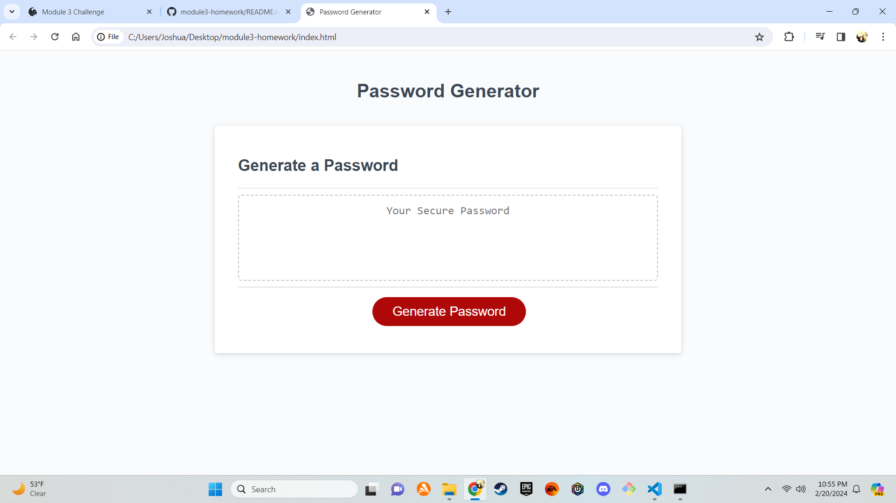

# module3-homework

##Password Generator
A simple password generator that allows you to generate secure passwords based on your chosen criteria.

##About the Project
The Password Generator is a web-based tool that allows you to create strong, random passwords that meet certain criteria such as length and character types. It's a convenient and secure way to generate passwords for your accounts, ensuring that your data remains protected.

##Getting Started
Open index.html in a web browser.

##Usage
Click the "Generate Password" button to start.
Answer the prompts for password criteria (length, character types).
Your password will be displayed in the text area.

##Contributing
Contributions are from the UCF Bootcamp by providing the source code of the homework.

##License
N/A

